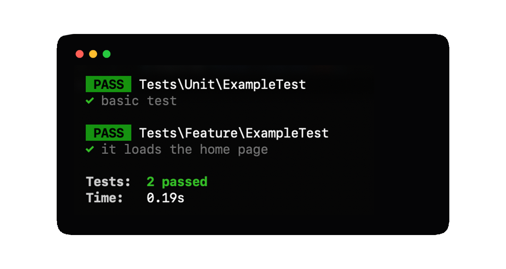
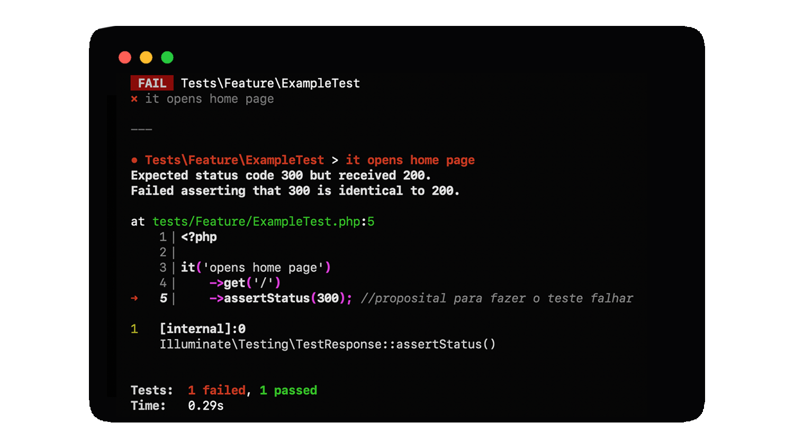
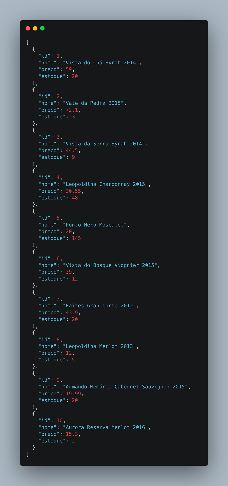
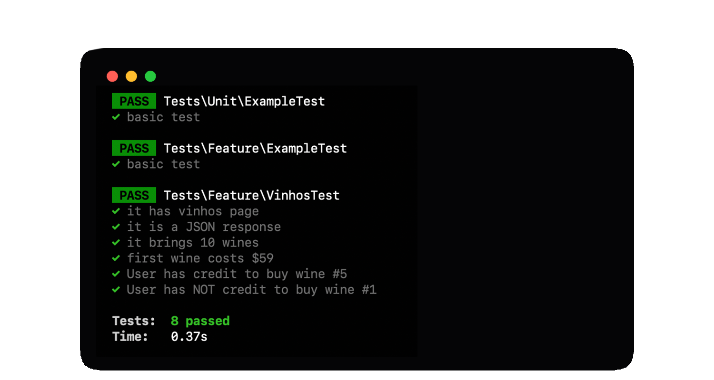

<div align="center">
	
    <br/>
</div>

# Conhecendo o PEST PHP (Laravel)

Bem vindo(a)!

**Motivação:** Após ver excelentes vídeos em inglês sobre o PEST eu pensei em criar este artigo introdutório para iniciantes em Laravel e em testes em geral. Pretendo em breve criar um repositório para exibir testes na prática. Espero que seja útil pra você!  

Aproveite para dar uma estrela ⭐ no [repositório do PEST](https://github.com/pestphp/pest)

É rápido e é grátis! Vai lá! Dê essa força pra todos que contribuem para o PEST.

# Índice

1. [O que é o Pest?](#1-o-que-%C3%A9-o-pest-php)
2. [Instalando no Laravel 8](#2-instalando-no-laravel-8)
  
    2.1. [Requerimentos](#21-requerimentos)
    
    2.2. [Instalação](#22-instala%c3%a7%c3%a3o)
    
3. [Primeiras impressões](#3-primeiras-impress%C3%B5es)

    3.1. [As funções de teste](#31-as-fun%C3%A7%C3%B5es-de-teste)
    
    3.2. [Primeiros passos](#32-primeiros-passos)
    
    3.3. [Testes bem legíveis](#33-testes-bem-leg%C3%ADveis)
    
    3.4.[Fazendo o teste falhar](#34-fazendo-o-teste-falhar)
    
4. [Emulando testes](#4-emulando-testes)
5. [Veja também](#5-veja-tamb%C3%A9m)

## 1. O que é o Pest PHP?

PEST é um framework para testes em PHP desenvolvido pelo [Nuno Naduro](https://github.com/nunomaduro) 🇵🇹. Esse framework foi pensado para ser elegante, facilitando a confecção dos testes, podendo escreve-los de forma descritiva, simples e objetiva.  O PEST pode rodar em qualquer projeto PHP, não depende de um framework específico, mas é claro que se tratando do Nuno, ele tem um plugin para Laravel.

O PEST também é compatível com o PHPUnit e pode utilizar suas funções, testes escritor para o PHPUnit continuarão à funcionar.

## 2. Instalando no Laravel 8

### 2.1 Requerimentos

- PHP 7.3+
- Composer.
- Um projeto em Laravel 8

### 2.2 Instalação

 Primeiro, instale o PEST via composer:

`composer require pestphp/pest --dev --with-all-dependencies`

No seu projeto Laravel, faça o requerimento do PEST:

`composer require pestphp/pest-plugin-laravel --dev`

Agora, execute o comando do Artisan para instalar o PEST:

`php artisan pest:install`

Execute o PEST

Linux: `./vendor/bin/pest`

Windows: `C:\meuprojeto> vendor\bin\pest`

Ou ainda, use o Artisan: `php artisan test`

Se tudo funcionou, vamos ver uma resposta como esta:


## 3. Primeiras impressões

### 3.1 As funções de teste

O PEST oferece duas funções para realizar testes, o `test()` e o `it()`. As duas oferecem a mesma sintaxe e comportamento.

Por questão únicamente de preferência eu vou usar a `it()`.  Pra mim, o "it" se refere ao método/função e como ele se comporta.

"It" é um pronome impessoal do inglês e siguinifica "ele/ela". Usamos "it" para  coisas (ex: computador, carro, livro), não pessoas (seu irmão, sua amiga).

Mãos à obra!!!

### 3.2 Primeiros passos

Observemos o arquivo `tests/Feature/ExampleTest.php`.

Este é o original:

````php
<?php

namespace Tests\Feature;

use Illuminate\Foundation\Testing\RefreshDatabase;
use Tests\TestCase;

class ExampleTest extends TestCase
{
    /**
     * A basic test example.
     *
     * @return void
     */
    public function testBasicTest()
    {
        $response = $this->get('/');

        $response->assertStatus(200);
    }
}
````

Nós humanos vamos ler esse arquivo linha por linha e mais ou menos da seguinte forma:

- *Estamos dentro do namescape Tests\Feature.*
- *Chamamos Illuminate\Foundation\Testing\RefreshDatabase.*
- *Também  chamamos o Test\Testcase.*
- *Esta classe extende o TestCase...*
- *Este é um exemplo básico de teste (A basic test example.).*
- *OK, temos um método  testBasicTest.*
- *Dentro dele,  a variável response receberá o resultado do método get para a rota "/".*
- *Certo! Depois, a variável response estará confirmando que o status desta resposta é 200."

Agora, vejamos a versão com PEST:

````php
<?php

it('loads the home page', function () {
    $response = $this->get('/');
    $response->assertStatus(200);
});
````

A frase "*it loads the home page*" pode ser livremente traduzida como "Ele carrega a página". Ou seja, estou descrevendo exatamente o que esse método testado faz, no caso, a rota "/" que é tem como função exibir a home page.
Poderia ser "ele calcula o desconto" ou "ele deleta o arquivo".

Alguns pontos interessantes de se ressaltar:

- Não precismamos de um namespace;
- Não é necessário extender nenhuma classe;
- Podemos ler exatamente o que o teste faz em linguagem humana, não em código.
- Veja o arquivo `tests/Pest.php`. Lá, o PEST está dizendo que os testes que estão na pasta Feature extenderão a classe TestCase: `uses(Tests\TestCase::class)->in('Feature');`. Isso faz com que possamos ter acesso a toda a api de testes que já conhecemos dentro do Laravel.

Ao executar  `./vendor/bin/pest` (Windows:C:\meuprojeto> vendor\bin\pest ), recebemos:



E como nós humanos vamos ler esse código?

- *Ele abre (tem que abrir) a home page*
- *Tem um argumento que é uma função (closure).*
- *Dentro, temos variável response receberá o resultado do método get para a rota "/".*
- *Certo! Depois, a variável response estará confirmando que o status desta resposta é 200.*

A simplicidade do PEST é incrível. Passamos de 21 linhas  para 6 linhas de código.

### 3.3 Testes bem legíveis

Será que podemos deixar esse código ainda mais legível? Sim!

````php
it('loads the home page')
    ->get('/')
    ->assertOK();
````

O PEST suporta "*Higher Order Messages*". Se você não passar uma função como argumento,  o PEST vai utilizar os métodos passados (*chained methods* ) como closures.

Com isso,  fomos de 21 uma linhas para 3!

Aproveitando, podemos user o método "assertOK" PHPUnit. Basta trocar``$response->assertStatus(200);`` por `->assertOK();`. Esse método que verifica se recebemos um status 200 e nosso código fica mais legível ainda.

### 3.4 Fazendo o teste falhar

Quando um teste falha o PEST apresenta uma mensagem de erro bem desenhada e amigável. Isso porque ele se vale do [Collision](https://github.com/nunomaduro/collision), outro pacote do Nuno Maduro.

O teste anterior garantiu que estamos recebendo o status "200", ou seja, tudo funcionou como o esperado.

Vamos fazer uma traquinagem e pedir ao teste verificar se recebemos o status 300.  A gente já sabe que recebemos o status 200, pedir o 300 é fazer o teste falhar propositalmente!

````php
it('opens home page')
    ->get('/')
    ->assertStatus(300); //proposital para fazer o teste falhar
````



O PEST nos informa amigavelmente onde está a falha e o que falhou.

````php
  Expected status code 300 but received 200.
  Failed asserting that 300 is identical to 200
````

Traduzindo:
Queria o status 300 mas recebeu 200.
Falhou em confirmar que 300 é idêntico a 200.

E a função `tests()`?
Em inglês, a descrição dos testes geralmente com o verbo testar, tipo  "test if" (teste se...) . Pra ganhar tempo e economizar repetir a palavra test no começo de cada frase, podemos usar esta função.

``
test('if the home page opens')
`` ("testa se a home page abre")

e isso funcionará da mesma maneira que:

``
it('opens home page')
``

Recomendo que você visite a [Documentação do PEST](https://pestphp.com/docs/) 🇺🇸 para conhecer um pouco mais!

## 4.Emulando testes

O objetivo deste artigo é demonstrar algumas funcionalidades do PEST. Para isso, vou simplificar ao máximo os requerimentos, não envolvendo nem mesmo um CRUD. Assim fica fácil também pra quem está começando com Laravel 😉.

No mundo real, é claro que os testes vão abranger funções mais complexas com regras de negócio elaboradas. Aqui, vamos apenas criar uma rota que retorna um JSON.

O primeiro passo é adicionar essa rota nova em `routes/web.php` da seguinte maneira:

````php
// Rota de vinhos pro PEST
Route::get('/vinhos', function () {
    return response()->json([
        ["id" => 1, "nome" => "Vista do Chá Syrah 2014", "preco" => 59.00, "estoque" => 20],
        ["id" => 2, "nome" => "Vale da Pedra 2015", "preco" => 72.10, "estoque" => 3],
        ["id" => 3, "nome" => "Vista da Serra Syrah 2014", "preco" => 44.50, "estoque" => 9],
        ["id" => 4, "nome" => "Leopoldina Chardonnay 2015", "preco" => 30.55, "estoque" => 48],
        ["id" => 5, "nome" => "Ponto Nero Moscatel", "preco" => 20.00, "estoque" => 145],
        ["id" => 6, "nome" => "Vista do Bosque Viognier 2015", "preco" => 39.00, "estoque" => 12],
        ["id" => 7, "nome" => "Raizes Gran Corte 2012", "preco" => 43.90, "estoque" => 20],
        ["id" => 8, "nome" => "Leopoldina Merlot 2013", "preco" => 12.00, "estoque" => 5],
        ["id" => 9, "nome" => "Armando Memória Cabernet Sauvignon 2015", "preco" => 19.99, "estoque" => 20],
        ["id" => 10, "nome" => "Aurora Reserva Merlot 2016", "preco" => 15.30, "estoque" => 2],
    ]);
});
// Fim da rota de vinhos
````

Esta rota simula que o sistema recebeu uma requisição para informar os 10 melhores vinhos Brasileiro segundo algum critério. Ele também vai trazer o preço e a quantidade em estoque de cada vinho.

Este é resultado JSON:



Para criar um novo teste, execute: `php artisan pest:test VinhosTest`.

O PEST irá criar o arquivo `tests/Feature/VinhosTest.php` e  vai colocar automaticamente dentro dele um teste para verificar se esta página existe.

"It has vinhos page" em Português é "Ele tem a página vinhos".

````php
it('has vinhos page', function () {
    $response = $this->get('/vinhos');
    $response->assertStatus(200);
});
````

Como já vimos anteriormente, podemos reduzir esse teste para:

````php
it('has vinhos page')
    ->get('/vinhos')
    ->assertOK();
````

Agora, seria interessante realmente confirmar que a rota nos trouxe um JSON e não uma resposta de texto ou HTML.
Para isso, criamos um teste "it has a JSON response" ou seja "ele tem uma resposta em JSON":

Neste teste podemos usar uma outra função do PEST, o "expect'. Expect pode ser traduzido livremente como "Esperar por algo". Ou seja, "Espero receber uma resposta em JSON".

````php
it('is a JSON response', function () {
    $vinhos = $this->get('/vinhos')->getContent();
    expect($vinhos)->toBeJson();
});
````

Nós sabemos que esta funcionalidade sempre vai trazer os 10 melhores vinhos. Nem 9, nem 11.
Seria interessante verificar isso, não?

Testaremos então "it brings 10 wines", ou seja, "ele traz 10 vinhos".

````php
it('brings 10 wines', function () {
    $vinhos = $this->json('GET', '/vinhos');
    $vinhos->assertJsonCount(10, '*');
});
````

Podemos também testar que o primeiro vinho custa $59.

````php
test('first wine costs $59', function () {
    $vinhos = $this->json('GET', '/vinhos');
    $vinhos->assertJsonPath('0.preco', 59); //Queremos a propriedade "preço" do item #0
});
````

Vamos imaginar agora que exista a possibilidade do usuário comprar vinhos pagando com o crédito que ele tem nessa aplicação.
Como já mencionado, numa aplicação real estaríamos interagindo com um Controller e iriamos testar um método tipo "CompraVinho", mas vamos brincar...

O vinho #5 custa $20 por garrafa. O usuário quer comprar 5 garrafas e tem $100 de crédito.
Vamos testar então:
"Temos 5 garrafas em estoque?"
"Usuário tem crédito para comprar o vinho #5?

````php
test('User has credit to buy wine #5', function () {
    $vinhos = $this->json('GET', '/vinhos');

    $quantidade = 5;
    $credito = 100;
    $total_compra = $vinhos[4]['preco'] * $quantidade;

    expect($quantidade)->toBeLessThanOrEqual($vinhos[0]['estoque']);
    expect($total_compra)->toBeLessThanOrEqual($credito);
});
````

(Note que aqui utilizamos o índice 4 pro array, já que ele começa com o índice 0).

Também podemos fazer o contrário, vamos testar que um usuário não tem crédito para comprar 5 unidades do vinho #1.
"Temos 5 garrafas em estoque?"
O vinho #1 custa $59 por garrafa. O usuário quer comprar 5 garrafas com seus $100 de crédito?

````php
test('User has NOT credit to buy wine #1', function () {

    $vinhos = $this->json('GET', '/vinhos');

    $quantidade = 5;
    $credito = 100;
    $total_compra = $vinhos[0]['preco'] * $quantidade;

    expect($quantidade)->toBeLessThanOrEqual($vinhos[0]['estoque']);
    expect($total_compra)->toBeGreaterThanOrEqual($credito);
});
````



## 5. Veja Também

- [Plugin para o VSCode](https://github.com/m1guelpf/better-pest)
- [Plugin pro PHPStorm](https://github.com/pestphp/pest-intellij)
- [Documentação do PEST](https://pestphp.com/docs/) 🇺🇸

## Créditos

- Inspirado na série [Michael Dyrynda]( https://www.youtube.com/playlist?list=PLNXrjfSe7qHncCyQYOqJBTsTbYPotMaZ8) 🇺🇸.
